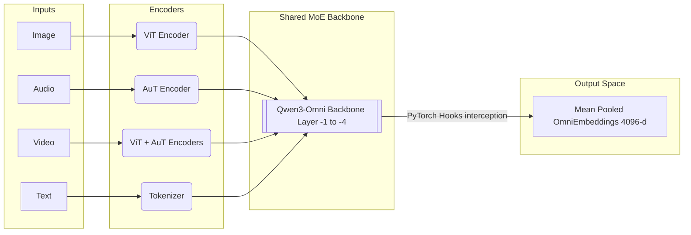

<div align="center">

# OmniEmbed
### Reverse-Engineering Universal Embeddings from Qwen3-Omni

[](https://www.python.org/downloads/release/python-3100/)
[](https://pytorch.org/)
[](https://huggingface.co/)
[](https://colab.research.google.com/)

</div>

---

## 👁️ Vision & Motivation
Modern "omni" models like Qwen3-Omni natively process text, audio, images, and video through a **shared representational backbone**. This means that within the neural network's geometry, a dog barking, the word "bark", and a photo of a dog occupy structurally similar regions of a high-dimensional space.

**This project intercepts and extracts that shared space.** 

By leveraging PyTorch forward hooks, we surgically extract these hidden state representations mid-inference—without the need for fine-tuning. The resulting **OmniEmbeddings** allow you to compute cross-modal cosine similarity directly (e.g., retrieving an audio clip directly from an image embedding) natively bypassing text intermediaries. 

Understanding and unifying these representations is at the frontier of multimodal search, grounded reasoning, and zero-shot cross-modal retrieval pipelines currently developed at top AI labs.

---

## 🧪 Core Research Hypotheses
1. **Semantic Unification:** Hidden states at the final transformer layers of Qwen3-Omni form a semantically coherent cross-modal space where concepts cluster together regardless of input modality.
2. **Modality Gap Correction:** Raw extracted geometric clusters exhibit systematic inter-modality offsets (the "Modality Gap"). This gap can be corrected mathematically—without backpropagation—using zero-mean standardization and ZCA Whitening decorrelation.
3. **Information Compression:** Applying PCA and constrained Matryoshka Projections collapses the 4096-dimensional embeddings to 512 dimensions while retaining ≥ 85% retrieval accuracy, effectively enabling mapping for realistic vector databases.

---

## 🏗 Architecture & Extraction Pipeline

Rather than utilizing output logits, our `HiddenStateExtractor` framework intercepts computation tensors iterating through the deepest transformer blocks, as they contain the clearest, most highly-abstract "modality-agnostic" representations of the input.

---

## 💻 Tech Stack & Engineering Methodologies
This repository acts as the clean bridge connecting research to practical Software Engineering modularity.

* **Non-invasive PyTorch Hooks:** Intercept state representations dynamically using context managers, preserving the model state safely.
* **Dimensionality Gap Tuning:** Implement strict Mathematical manipulations including `Z-Score scaling`, `Mean-Centering`, and complete covariance SVD mappings to reach `ZCA Whitening`.
* **Evaluation Frameworks:** Built-in modular calculation matrices tracking internal $L_2$ drift boundaries alongside Standard `Recall@K` validations.
* **Quantization Reliability:** Logic handles offloading internal processing state over to `bitsandbytes` **4-bit (NF4)** quantizations transparently. This gracefully handles compute-bound environments natively.

### Clean Repository Layout
```text
omniembed/
├── omniembed/                   # Core Python library module
│   ├── extractor.py             # Hidden state interception logic
│   ├── alignment.py             # Normalization and ZCA whitening logic
│   ├── compression.py           # Dimensionality reduction (PCA/Matryoshka)
│   ├── retrieval.py             # Recall validation matrices
│   └── viz.py                   # Seaborn/UMAP projections 
├── scripts/                     # Operational generic CLI pipeline layers
├── notebooks/                   # Hands-on visualization execution checkpoints
└── tests/                       # Complete PyTest suite coverage
```

---

## 🚀 Setup & Reproducibility
The project heavily utilizes PyTorch and the HuggingFace `transformers` suite.

### Standard Installation
```bash
conda create -n omniembed python=3.10
conda activate omniembed

git clone https://github.com/TinevimboMusingadi/OmniEmbed.git
cd OmniEmbed

pip install -r requirements.txt
pip install -e .
```

### Free-Tier Cloud Integration (Google Colab)
Running heavily scaled 30-Billion parameter multimodal variants natively demands extreme hardware limits. We mapped all end-to-end extraction setups to interactive Jupyter Notebooks uniquely tuned with smart boundary checks that handle Google Colab instances automatically.

Interact with the pipeline logic through the `notebooks/` directory:
1. `00_model_exploration.ipynb`: Setup and hardware footprint analysis limits.
2. `01_baseline_extraction.ipynb`: Harvesting and generating representation structures dynamically.
3. `02_modality_gap_analysis.ipynb`: Visualizing distribution drifts and executing structural gap alignment closures. 
4. `03_compression_tradeoffs.ipynb`: Optimizing database density dimensions.

---

## 🎯 Code Quality & Testing
We enforce strict pipeline testing dynamically enforcing constraints across logic components using standardized testing formats.

To execute the offline core metrics checking engine:
```bash
pytest -v tests/
```
